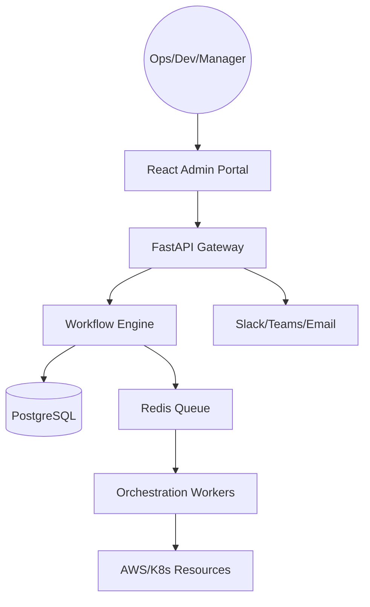
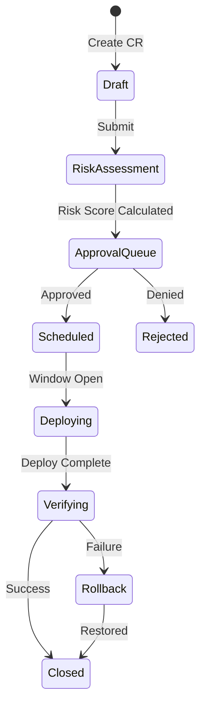
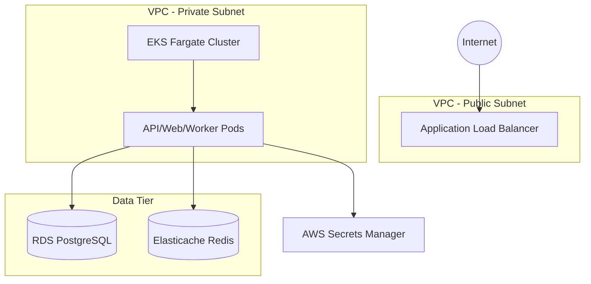
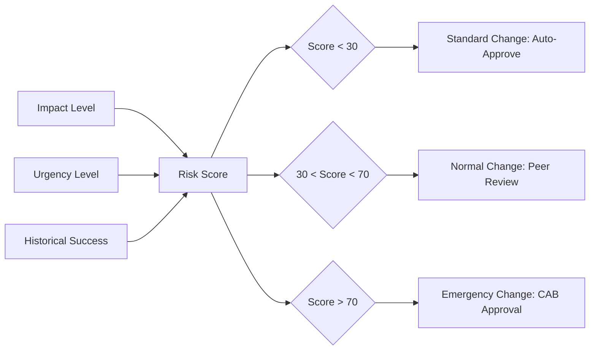
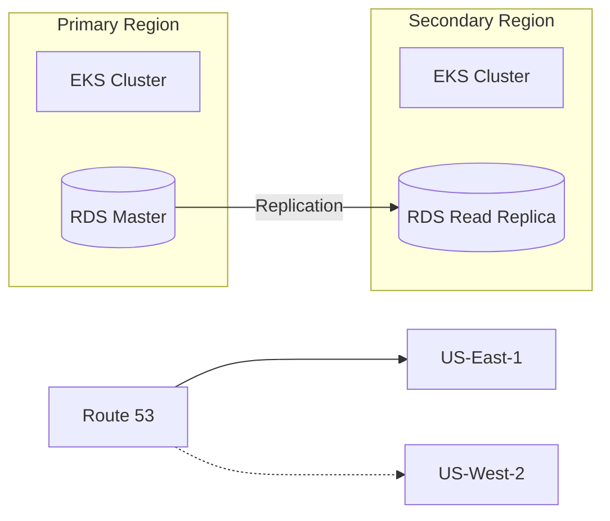
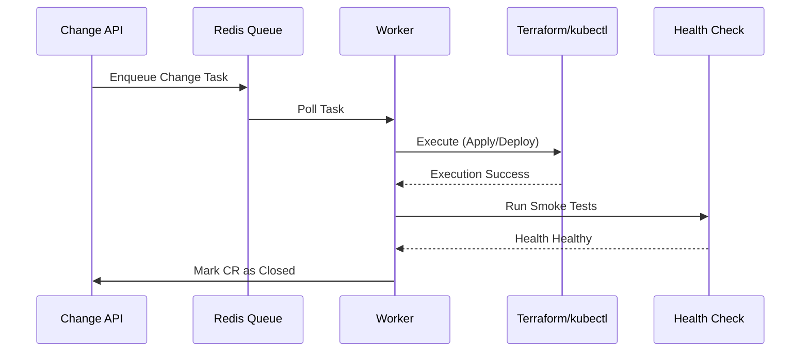
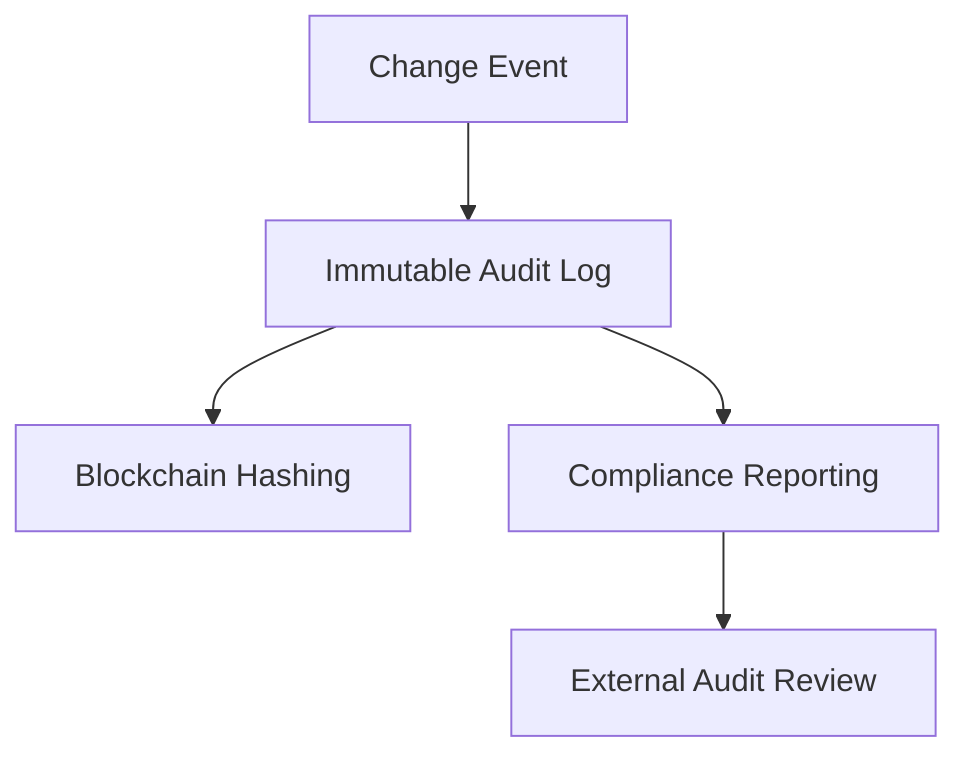

<h1>Change Orchestration</h1>

<strong>The Enterprise Flagship Platform for Governed Infrastructure, Application, and Operational Lifecycle Management</strong>

 

> **"Change with Confidence, Deploy with Authority."** 
> Change Orchestration is an institutional-grade platform designed to synchronize complex infrastructure mutations and application releases across multi-region environments with absolute traceability and automated governance.

---

## 🏛️ Executive Summary

In the modern enterprise, "change" is the highest-risk event. **Change Orchestration** solves the fragmentation between development velocity and operational stability. It provides a unified Control Plane for managing Change Requests (CRs), risk-weighted approvals, scheduled maintenance windows, and automated deployment orchestration.

By integrating directly with **Terraform**, **Kubernetes**, and **CI/CD pipelines**, the platform ensures that no mutation occurs without proper authorization, risk assessment, and an automated rollback strategy.

---

## 🚀 Key Features

- **Centralized Change Ledger**: A single source of truth for every infrastructure and application change.
- **Risk-Based Workflows**: Automated risk scoring determines the approval path (Manual vs. Peer-Reviewed vs. Automated).
- **Maintenance Windows**: Enforce deployment silences during critical business events or low-traffic periods.
- **Automated Rollbacks**: One-click restoration of system state upon failed health checks or manual intervention.
- **Multi-Environment Promotion**: Securely promote changes from `dev` to `staging` and `prod` with explicit compliance gates.
- **Audit & Compliance**: Immutable audit trails for every change event, satisfying SOC2, HIPAA, and GDPR requirements.
- **Notifications & ChatOps**: Real-time updates via Slack, Microsoft Teams, and Email for approval requests and deployment status.

---

## 🛠️ Tech Stack

| Layer | Technology | Rationale |
|---|---|---|
| **Frontend** | React 18, TypeScript, Vite, Tailwind CSS | High-performance, type-safe operations dashboard. |
| **Backend** | FastAPI (Python), Pydantic | Asynchronous, low-latency API gateway for change management logic. |
| **Database** | PostgreSQL | Relational integrity for complex change workflows and audit logs. |
| **Async Tasks** | Redis | Queueing system for background deployment orchestration and scheduling. |
| **Infra** | Terraform, AWS EKS, RDS | Cloud-native, scalable infrastructure as code. |
| **DevOps** | Docker, GitHub Actions | Standardized containerization and CI/CD pipelines. |
| **Observability** | OpenTelemetry, Prometheus, Grafana | Full-stack visibility into change health and platform performance. |

---

## 📐 Architecture & Workflow Deep-Dive

### 1. High-Level System Architecture

### 2. Change Lifecycle Flow

### 3. Deployment Architecture (AWS EKS)

### 4. Risk Scoring Matrix Logic

### 5. Multi-Region DR Topology

### 6. Orchestration Worker Lifecycle

### 7. Governance & Compliance Loop

---

## 🚦 Getting Started

### Local Development (Monorepo)
1. **Bootstrap**: `npm install` (root)
2. **Environment**: `cp .env.example .env`
3. **Launch Containers**: `docker-compose up --build -d`
4. **Access**:
   - Web: `http://localhost:3000`
   - API: `http://localhost:8000/docs`

### Extended Documentation
- [Operations Guide](docs/architecture/operations-guide.md)
- [Deployment Runbook](docs/runbooks/deploy.md)
- [API Specification](docs/architecture/api-spec.md)

---

## 🤝 Support & Roadmap
- **Platform Inquiries**: platform@devopstrio.com
- **Enterprise Status**: [Status Page](https://status.devopstrio.com)

**Engineering the future of enterprise operations — one change at a time.**

