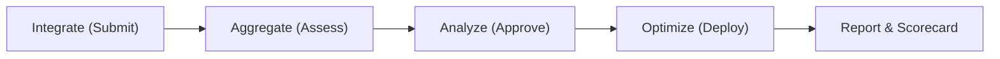
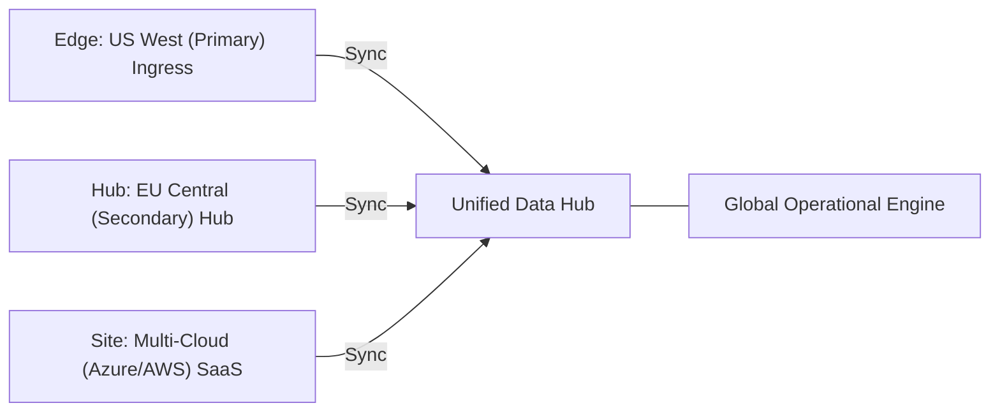
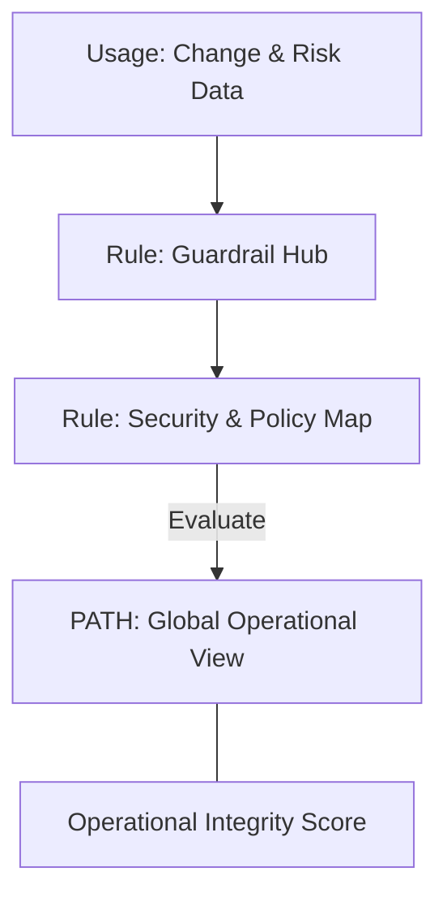
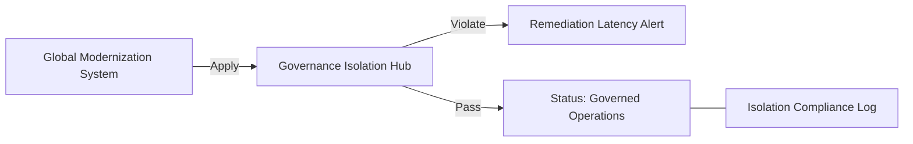
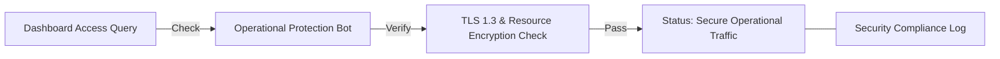
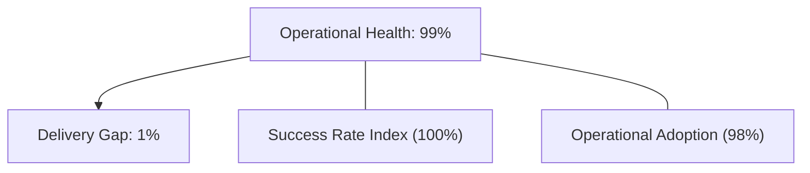
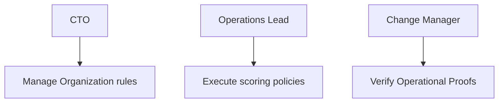
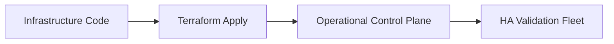
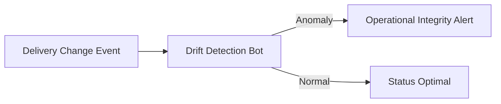
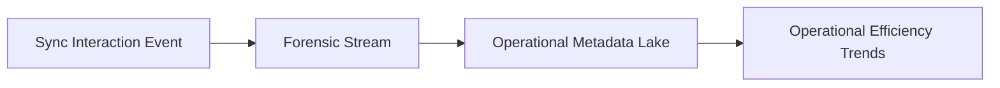

<div align="center">


<h1>Change Orchestration</h1>

<p><strong>The Institutional-Grade Platform for Standardized Operational Foundations, Change Governance, and Multi-Cloud Orchestration Ecosystems.</strong></p>

[]()
[]()
[]()

<br/>

> **"Industrializing operational change to automate lifecycle foundations."** 
> **Change Orchestration** is an enterprise-grade platform designed to provide a secure, measurable, and highly automated foundation for global operations. It orchestrates the complex lifecycle of operational change—from automated risk assessment and multi-cloud approval reconciliation to high-throughput deployment intelligence and unified operational auditing.

</div>

---

## 🏛️ Executive Summary

Fragmented change management and manual operational risk are strategic operational liabilities; lack of a standardized change orchestration framework is a primary barrier to organizational engineering maturity. Organizations fail to maintain operational stability not because of a lack of talent, but because of fragmented evaluation standards, lack of automated risk-weighting, and an inability to orchestrate operational planes with operational precision.

This platform provides the **Operational Intelligence Plane**. It implements a complete **Change-Orchestration-as-Code Framework**, enabling CTOs and Operations Leads to manage global operational foundations as first-class citizens. By automating the identification of change regressions through real-time telemetry analysis and orchestrating the provisioning of secure performance-driven operational policies, we ensure that every organizational mutation—from core infrastructure updates to edge application patches—is governed by default, audited for history, and strictly aligned with institutional operational frameworks.

---

## 📐 Architecture Storytelling: Principal Reference Models

### 1. Principal Architecture: Global Change Orchestration & Operational Intelligence Plane
This diagram illustrates the end-to-end flow from operational telemetry ingestion and multi-cloud orchestration to change enforcement, performance validation, and institutional operational auditing.


```mermaid
graph LR
    %% Subgraph Definitions
    subgraph OperationalIngress["Change & Risk Ingress"]
        direction TB
        Change_Signals["CR Submissions / Maintenance Windows"]
        Risk_Definitions["Impact Levels / Urgency / History"]
        Org_Hierarchies["Business Unit / Approval Mappings"]
    end

    subgraph IntelligenceEngine["Operational Intelligence Hub"]
        direction TB
        API["FastAPI Operational Gateway"]
        ChangeOrchestrator["Global Risk & Approval Hub"]
        Governance_Hub["Compliance & Guardrail Hub"]
        AIOps_Validator["Drift & Stability Analysis Hub"]
    end

    subgraph OperationsPlane["Distributed Operational Ecosystem"]
        direction TB
        ManagedChangeNodes["Managed Standardized Orchestration Nodes"]
        ActiveRunbooks["Managed Automated Remediation Runbooks"]
        DeliverySinks["Managed Infrastructure Delivery Hubs"]
    end

    subgraph OperationsHub["Institutional Data Hub"]
        direction TB
        Scorecard["Operational Maturity Scorecard"]
        Analytics["Change Flow & Stability Velocity Stats"]
        Audit["Forensic Operational Metadata Lake"]
    end

    subgraph DevOps["Change-Orchestration-as-Code Framework"]
        direction TB
        TF["Terraform Operational Modules"]
        DriftBot["Productivity & Config Drift Validator"]
        ChatOps["Measurement Operations Hub"]
    end

    %% Flow Arrows
    OperationalIngress -->|1. Submit Telemetry| API
    API -->|2. Orchestrate Operations| ChangeOrchestrator
    ChangeOrchestrator -->|3. Apply Privacy Guard| Governance_Hub
    Governance_Hub -->|4. Assess Drift| AIOps_Validator
    
    AIOps_Validator -->|5. Execute Deployment| OperationsPlane
    OperationsPlane -->|6. Notify Status| ChatOps
    API -->|7. Visualize Health| Scorecard
    
    Scorecard -->|8. Track Maturity| Analytics
    Scorecard -->|9. Record Performance| Audit
    
    TF -->|10. Provision Backbone| IntelligenceEngine
    DriftBot -->|11. Inject Friction Risk| ChangeOrchestrator
    Audit -->|12. Improve Operations| ManagedChangeNodes

    %% Styling
    classDef ingress fill:#f5f5f5,stroke:#616161,stroke-width:2px;
    classDef intel fill:#e8eaf6,stroke:#1a237e,stroke-width:2px;
    classDef operations fill:#e1f5fe,stroke:#01579b,stroke-width:2px;
    classDef ops fill:#ede7f6,stroke:#311b92,stroke-width:2px;
    classDef devops fill:#e8f5e9,stroke:#1b5e20,stroke-width:2px;

    class OperationalIngress ingress;
    class IntelligenceEngine intel;
    class OperationsPlane operations;
    class OperationsHub ops;
    class DevOps devops;
```

### 2. The Change Lifecycle Flow
The continuous path of an enterprise operations platform from initial integration (submit) and aggregation (assess) to active analysis (approve), optimization (deploy), and institutional forensic auditing (scorecard).


```mermaid
graph LR
    Integrate["Integrate (Submit)"] --> Aggregate["Aggregate (Assess)"]
    Aggregate --> Analyze["Analyze (Approve)"]
    Analyze --> Optimize["Optimize (Deploy)"]
    Optimize --> Report["Report & Scorecard"]
```

### 3. Distributed Operational Topology
Strategically orchestrating standardized operations across global regions, diverse cloud architectures, and multi-cloud targets, providing a unified institutional view of global operational health and operational readiness.


```mermaid
graph LR
    RegionA["Edge: US West (Primary) Ingress"] -->|Sync| Hub["Unified Data Hub"]
    BU["Hub: EU Central (Secondary) Hub"] -->|Sync| Hub
    Cloud["Site: Multi-Cloud (Azure/AWS) SaaS"] -->|Sync| Hub
    Hub --- Logic["Global Operational Engine"]
```

### 4. Governance Hub & High-Trust Data Plane Protection Flow
Executing complex logic for securing the bridge between change owners and technical teams, ensuring every organizational identity is verified, change-level privacy is maintained, and every operational access is according to institutional standards.


```mermaid
graph TD
    OperationalData["Usage: Change & Risk Data"] --> Bridge["Rule: Guardrail Hub"]
    Bridge --> PolicyMap["Rule: Security & Policy Map"]
    PolicyMap -->|Evaluate| Context["PATH: Global Operational View"]
    Context --- Estimate["Operational Integrity Score"]
```

### 5. Multi-Cloud Change Federation & Governance Flow
Automatically managing unified operational standards across global regions and diverse cloud tenants, ensuring institutional data residency and privacy boundaries by default.


```mermaid
graph LR
    Org["Global Modernization System"] -->|Apply| Guard["Governance Isolation Hub"]
    Guard -->|Violate| Alert["Remediation Latency Alert"]
    Guard -->|Pass| Verify["Status: Governed Operations"]
    Verify --- Audit["Isolation Compliance Log"]
```

### 6. Encryption & Perimeter Protection Flow (Change Standard)
Managing the lifecycle of an operational request, automatically enforcing institutional TLS 1.3 and resource encryption standards as required by security policy, ensuring zero-latency security confidence.


```mermaid
graph LR
    OperationalReq["Dashboard Access Query"] -->|Check| Gatekeeper["Operational Protection Bot"]
    Gatekeeper -->|Verify| TLS["TLS 1.3 & Resource Encryption Check"]
    TLS -->|Pass| Admit["Status: Secure Operational Traffic"]
    Admit --- Audit["Security Compliance Log"]
```

### 7. Institutional Operational Maturity Scorecard
Grading organizational performance based on key indicators: Change Success Rate Index, Risk Accuracy Index, and Operational Adoption Scores.


```mermaid
graph TD
    Post["Operational Health: 99%"] --> Risk["Delivery Gap: 1%"]
    Post --- C1["Success Rate Index (100%)"]
    Post --- C2["Operational Adoption (98%)"]
```

### 8. Identity & RBAC for Change Governance
Managing fine-grained access to operational hubs, provisioning workers, and audit logs between CTOs, Operations Leads, and Change Managers.


```mermaid
graph TD
    CTO["CTO"] --> Hub["Manage Organization rules"]
    Lead["Operations Lead"] --> Exec["Execute scoring policies"]
    Manager["Change Manager"] --> Audit["Verify Operational Proofs"]
```

### 9. IaC Deployment: Change-Orchestration-as-Code Framework
Using modular Terraform to deploy and manage the versioned distribution of the operational tracking hubs, sync protection workers, and forensic metadata lakes.


```mermaid
graph LR
    HCL["Infrastructure Code"] --> TF["Terraform Apply"]
    TF --> Engine["Operational Control Plane"]
    Engine --> Clusters["HA Validation Fleet"]
```

### 10. AIOps Operational Drift & Risk Validation Flow
Using advanced analytics to identify sudden surges in failed changes, unauthorized rule changes, suspicious configuration drifts, or unusual delivery pattern changes that could result in institutional risk or downtime.


```mermaid
graph LR
    Drift["Delivery Change Event"] --> Analyzer["Drift Detection Bot"]
    Analyzer -->|Anomaly| Alert["Operational Integrity Alert"]
    Analyzer -->|Normal| Pass["Status Optimal"]
```

### 11. Metadata Lake for Forensic Operational Audit
Storing long-term records of every operational integration event (metadata), every change executed, and every version history for institutional record-keeping, compliance auditing, and post-provisioning forensics.


```mermaid
graph LR
    Provision["Sync Interaction Event"] --> Stream["Forensic Stream"]
    Stream --> Lake["Operational Metadata Lake"]
    Lake --> Trends["Operational Efficiency Trends"]
```

---

## 🏛️ Core Governance Pillars

1.  **Unified Foundation Coordination**: Maximizing resilience by centralizing all operational measurement through a single institutional plane.
2.  **Automated Change Provisioning**: Eliminating "manual tracking" scenarios through proactive orchestration and pattern verification.
3.  **Sequential Operational Intelligence**: Ensuring zero-interruption operations through dependency-aware change-driven data engineering.
4.  **Zero-Trust Identity Protection**: Automatically enforcing identity-based access, data-at-rest encryption, and policy evaluation across all assurance tiers.
5.  **Autonomous Operations Logic**: Guaranteeing reliability through automated industry-specific effectiveness monitoring runbooks.
6.  **Full Operational Auditability**: Immutable recording of every change event and operational provision for institutional forensics.

---

## 🛠️ Technical Stack & Implementation

### Operational Engine & APIs
*   **Framework**: Python 3.11+ / FastAPI.
*   **Performance Engine**: Custom Python-based logic for multi-cloud change reconciliation and DORA-style operational metrics.
*   **Integrations**: Native connectors for Terraform, Kubernetes, and ITSM toolchains.
*   **Persistence**: PostgreSQL (Operational Ledger) and Redis (Live Orchestration State).
*   **Auth Orchestrator**: Federated OIDC/SAML for least-privilege operational management access.

### Governance Dashboard (UI)
*   **Framework**: React 18 / Vite.
*   **Theme**: Dark, Slate, Indigo (Modern high-fidelity productivity aesthetic).
*   **Visualization**: D3.js for delivery topologies and Recharts for stability velocity analytics.

### Infrastructure & DevOps
*   **Runtime**: AWS EKS or Azure Kubernetes Service (AKS) for management plane.
*   **Measurement Hub**: Managed event sourcing for immutable productivity timeline reconstruction.
*   **IaC**: Modular Terraform for deploying the operational landing zone and validation fleet.

---

## 🏗️ IaC Mapping (Module Structure)

| Module | Purpose | Real Services |
| :--- | :--- | :--- |
| **`infrastructure/operational_hub`** | Central management plane | EKS, PostgreSQL, Redis |
| **`infrastructure/enforcers`** | Distributed change provisioners | Terraform, kubectl, Cloud APIs |
| **`infrastructure/change_pipes`** | Data Ingestion Hubs | Webhooks, Lambda |
| **`infrastructure/auditing`** | Forensic modernization sinks | S3, Athena, Quicksight |

---

## 🚀 Deployment Guide

### Local Principal Environment
```bash
# Clone the Change Orchestration repository
git clone https://github.com/devopstrio/change-orchestration.git
cd change-orchestration

# Configure environment
cp .env.example .env

# Launch the Operational stack
make init

# Trigger a mock operational update and automated guardrail validation simulation
make simulate-change
```

Access the Management Portal at `http://localhost:3000`.

---

## 📜 License
Distributed under the MIT License. See `LICENSE` for more information.

---
<div align="center">
  <p>© 2026 Devopstrio. All rights reserved.</p>
</div>
